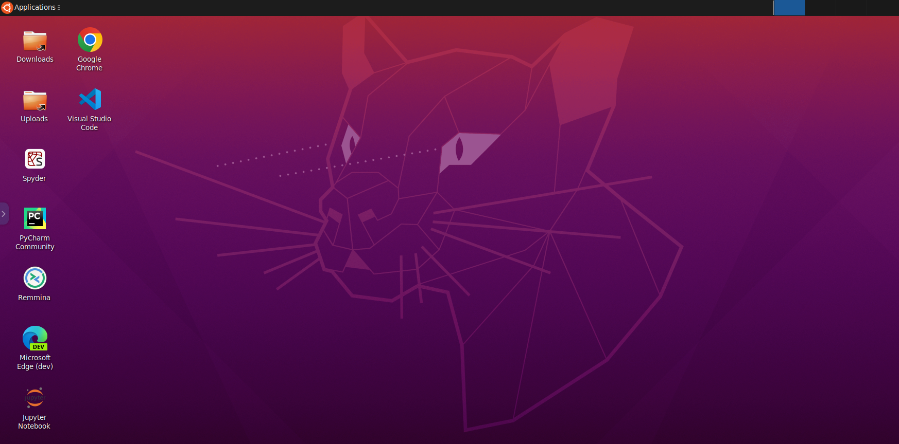

# Kasm Workspaces CoLab ( CoLab-Runner )

This project provides a desktop environment but is more so fit to be used by google colab as a local machine. This will speed up project while you are running this. 




# GPU Support

Kasm Workspaces (formally Kasm Server) version 1.9.0 and higher supports NVIDIA GPUs. The following requirements must be met.
* NVIDIA GPUs with Architecture >= Kepler (or compute capability 3.0)
* NVIDIA container toolkit must be installed on the host

The agent component will report to the API service the number of GPUs and if the Docker daemon is showing the "nvidia" runtime is available. In the Admin panel the Agents view will list all available compute (Agents) available along with the number of GPUs they are reporting. The following screenshot shows a deployment with two Agents, one with a GPU and one without.


# Docker Hub

The docker hub for this project is here: https://hub.docker.com/repository/docker/kasmcommunity/colab


# Manual Deployment ( If you dont have Kasm )

While this image is primarily built to run inside the Kasm Workspaces platform, it can also be executed manually by itself.  Please note that certain functionality, such as audio, web filtering, uploads/downloads, etc, is only available within the Kasm platform.

```
sudo docker run --rm  -it --shm-size=512m -p 6901:6901 -e VNC_PW=password kasmcommunity/colab:1.11.0-rolling
```

The container is now accessible via a browser : `https://<IP>:6901`

 - **User** : `kasm_user`
 - **Password**: `password`


# Adding a new workspace image ( Recommended way )

See our other repo ( https://github.com/kasm-community/workspaces-machine-learning )


# Help Us Make It Better

You can help make this better by submitting a pull request with new features and bug fixes.
